<br/>
<p align="center">
  

  <h3 align="center">SPA: Comments</h3>

  <p align="center">
    Single page application named Comments
    <br/>
    <br/>
    <a href="http://ec2-3-252-200-218.eu-west-1.compute.amazonaws.com">View Demo</a>
  </p>
</p>

## Table Of Contents

* [About the Project](#about-the-project)
* [Built With](#built-with)
* [Getting Started](#getting-started)
  * [Installation Client](#installation-client)
  * [Installation Server](#installation-server)
  * [Installation DataBase](#installation-database)
* [Features of development](#features-of-development)
* [Deployment](#deployment)
* [Author](#author)

## About The Project

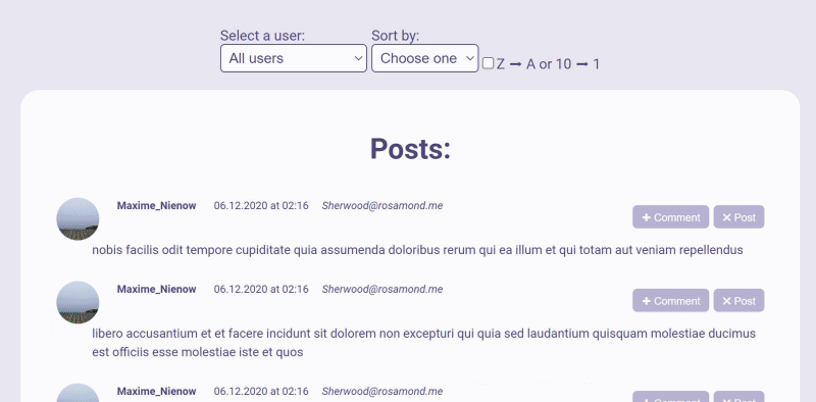

By default the application has 10 authors, who have written several posts and some none. In the select element displayed them usernames.

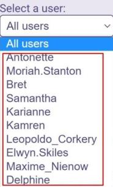

The first time you run the application, all the posts that were written by all authors are displayed. There are 25 posts per page.

[Video](https://www.loom.com/share/ed9bacc1dbf946839bbbe44e018b683e)

The header has a selector with which the user can select one of 10 authors and then the page will show posts only the selected author. When all the post is displayed, you can use sorting by "Username", "Email", "Date"(Date of post). The checkbox allows you to select the sorting mode. LIFO is installed by default.
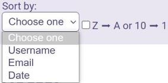
One post of the author contains the username avatar, the date of the author's post and email. The post has a “+Comment” and “xPost” button and text of the post itself.
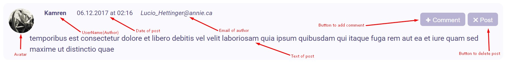
Users who read author's post can leave their comments by pressing the “+Comment” button. A window opens with all existing comments
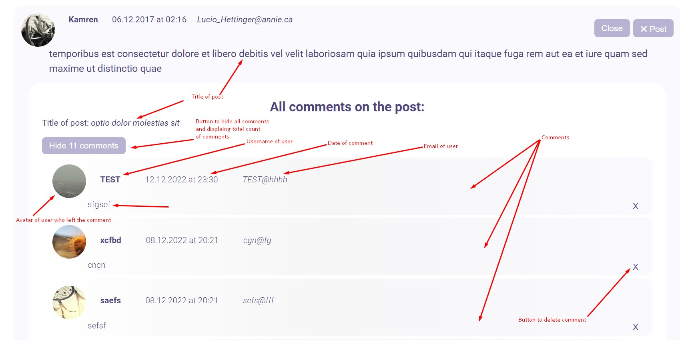
and a form with the appropriate fields that the user must complete according to the requirements. When the auxiliary text is green, it means that the correct data is entered.
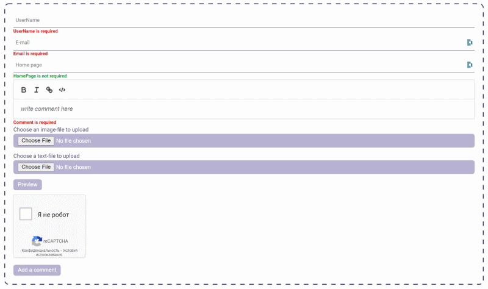

There is a possibility to attach a graphic file format JPG, GIF, PNG to the message. The picture is integrated into the user's comment in compressed format up to size 320x240. You can attach a text file in the TXT format, which is not larger than 100KB, the contents of the text file are integrated into the comment.
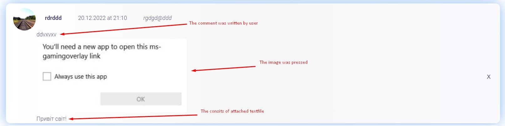
By clicking the Preview button, you can preview your message, where the image will be displayed in its original size, 
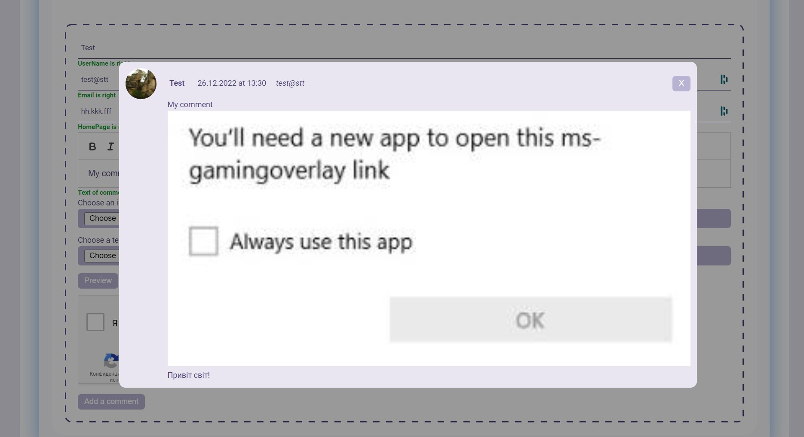
and when you publish a comment, the image will be compressed to the above size. If all the data is correct and you have completed the task of the widget Recapcha, you can click on the button "Add a comment", the comment will be in the list of all comments to the chosen post. You can delete a comment by pressing the “X” button opposite the comment text.

The user can format his message by attaching the link, making the font bold, italic, and note that the given text will be a code element. 
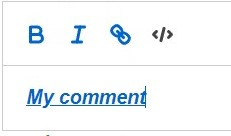

Data is collected on the client and server side. All data is stored in the database on which the server is running.

## Built With
The application has 3 parts:
* Client
* Server
* Database

 Client was created by using:
<h5 align="left">Languages, Frameworks and Tools:</h5>
<p align="left">
<a href="https://aws.amazon.com" target="_blank" rel="noreferrer">  </a>
<a href="https://www.gnu.org/software/bash/" target="_blank" rel="noreferrer"> 
 </a> 
<a href="https://www.w3schools.com/css/" target="_blank" rel="noreferrer">  </a> 
</a> 
<a href="https://git-scm.com/" target="_blank" rel="noreferrer">  
</a>
<a href="https://www.w3.org/html/" target="_blank" rel="noreferrer">  
</a> 
<a href="https://developer.mozilla.org/en-US/docs/Web/JavaScript" target="_blank" rel="noreferrer">  
</a> 
<a href="https://nodejs.org" target="_blank" rel="noreferrer">  
</a>
<a href="https://postman.com" target="_blank" rel="noreferrer">  
</a> 
<a href="https://reactjs.org/" target="_blank" rel="noreferrer">  </a> <a href="https://redux.js.org" target="_blank" rel="noreferrer">  
</a> 
<a href="https://sass-lang.com" target="_blank" rel="noreferrer">  </a> <a href="https://www.typescriptlang.org/" target="_blank" rel="noreferrer">  
</a> 
<a href="https://webpack.js.org" target="_blank" rel="noreferrer">  
</a> 
</p>

 Server was created by using:
<h5 align="left">Languages, Frameworks and Tools:</h5>

<p align="left"> 
<a href="https://aws.amazon.com" target="_blank" rel="noreferrer">  
</a> <a href="https://www.gnu.org/software/bash/" target="_blank" rel="noreferrer">  </a> <a href="https://expressjs.com" target="_blank" rel="noreferrer">  </a> <a href="https://git-scm.com/" target="_blank" rel="noreferrer">  </a> <a href="https://developer.mozilla.org/en-US/docs/Web/JavaScript" target="_blank" rel="noreferrer">  </a> <a href="https://www.linux.org/" target="_blank" rel="noreferrer">  </a> <a href="https://www.nginx.com" target="_blank" rel="noreferrer">  </a> <a href="https://nodejs.org" target="_blank" rel="noreferrer">  </a> <a href="https://www.postgresql.org" target="_blank" rel="noreferrer">  </a> <a href="https://postman.com" target="_blank" rel="noreferrer">  </a></p>

 DataBase was created by using:
<h5 align="left">Languages, Frameworks and Tools:</h5>

<p align="left"> 
<a href="https://aws.amazon.com" target="_blank" rel="noreferrer">  
</a> <a href="https://developer.mozilla.org/en-US/docs/Web/JavaScript" target="_blank" rel="noreferrer">  </a> <a href="https://www.linux.org/" target="_blank" rel="noreferrer">  </a> <a href="https://www.nginx.com" target="_blank" rel="noreferrer">  </a> <a href="https://nodejs.org" target="_blank" rel="noreferrer">  </a> <a href="https://www.postgresql.org" target="_blank" rel="noreferrer"> </a></p>


## Getting Started

To get a local copy up and running follow these simple example steps.

### Installation Client

1. Install Client

2. Clone the repo

```sh
git clone https://github.com/vlasiuk-anatolii/comments
```

3. Install NPM packages

```sh
npm install
```

4. Check that const BASE_URL is exactly http://127.0.0.1:5000 in src/api/api.ts

```JS
const BASE_URL = 'http://127.0.0.1:5000';
```
5. Type in the terminal

```sh
npm start
```
6. After that client will start on http://127.0.0.1:3000

### Installation Server

1. Install Server

2. Clone the repo

```sh
git clone https://github.com/vlasiuk-anatolii/server-comments
```

3. Install NPM packages

```sh
npm install
```
4. Type in the terminal

```sh
nodemon ./src/createServer.js
```

5. After that you should see:

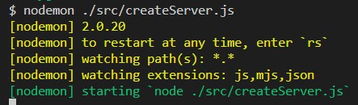

6. It means that your server is started.

### Installation DataBase

1. Files for restore db exist in the folder backup-db which you got when cloned Client/

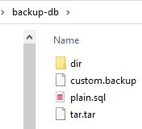
2. Install on your computer PostgreSQL

3. Creat empty database with name Post-Comments
4. You should used utility of PostgreSQL such as pg_restore and restore data base with specified name.
5. Restored database must consists 3 tables: 'users', 'posts', 'comments'.

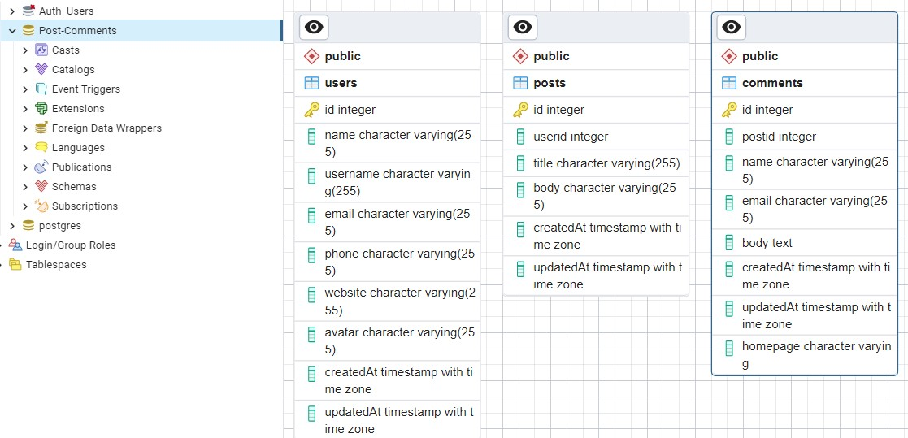
6. If you reached this, it means that your have done all steps well.

You can use system!

## Features of development
 If request includes html tags which not allowed then server will respond "Bad request".

 The server interacts with database through ORM "Sequelize". Sequelize escapes replacements, which avoids the problem SQL injection attacks.

 The server was implemented by using MVC architectural pattern.

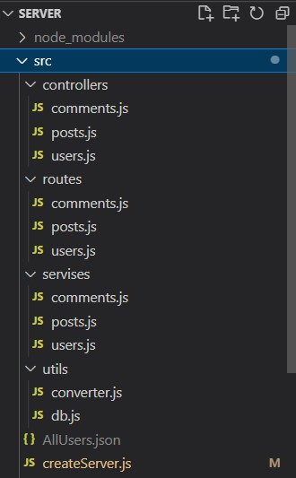

 In accordance with the policy of CORS was used cors node.js package.

 Nginx server was used for redirection data to 80 port.

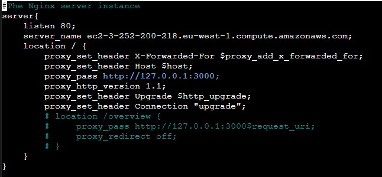

## Deployment
Was choosed a place for deploy - AWS.
Was created instance on EC2 service.

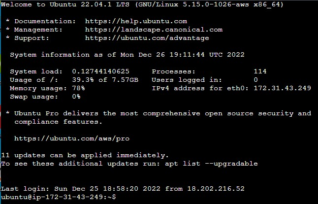
All elements of project were migrated from Windows platform to Ubuntu

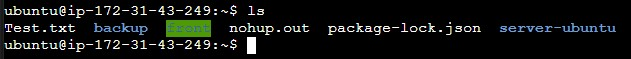
The "backup" folder has files for restore database.
The "front" folder has files for launch client.
The "server-ubuntu" folder has files for launch server.

## Author

* **Vlasiuk Anatolii** - [Vlasiuk Anatolii](https://github.com/vlasiuk-anatolii) - *Built SPA: Comments*
